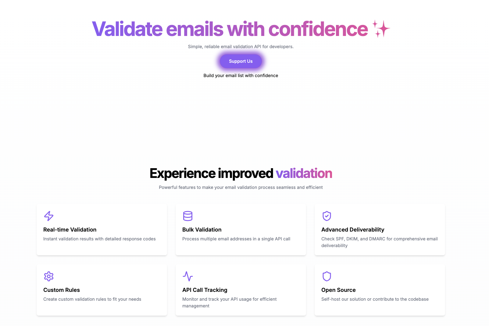

# Email Validator

This project provides a simple and efficient solution to validate email addresses. It can be easily integrated into your web applications, ensuring that users provide valid and correctly formatted email addresses before submission.



## Features

- **Valid Email Format**: Ensures the email matches standard email format rules.
- **Domain Validation**: Checks whether the email domain is valid and reachable.
- **Customizable Validation Rules**: You can configure additional rules for validation based on your application's requirements.
- **Fast and Reliable**: Built to be lightweight and optimized for quick validation.

## Installation

To install the email validator, follow these steps:

1. **Clone the Repository**:

   Clone the repository to your local machine:

   ```bash
   git clone https://github.com/yourusername/your-email-validator.git
   cd your-email-validator
   ```

2. **Install Dependencies**:

   Install the required dependencies using `pip`:

   ```bash
   pip install -r requirements.txt
   ```

3. **Set Up Environment Variables**:

   Before using the project, you need to configure the necessary environment variables.

   1. Copy the `.env.example` file to `.env`.

   ```bash
   cp .env.example .env
   ```

   2. Open the `.env` file and fill in the required fields for the database and email configuration:

   ```bash
   PROJECT_NAME=example
   SECRET_KEY=example
   ALGORITHM=example
   ACCESS_TOKEN_EXPIRE_MINUTES=example

   WEBHOOK_TOKEN=example

   MYSQL_USER=example
   MYSQL_PASSWORD=example
   MYSQL_HOST=example
   MYSQL_PORT=example
   MYSQL_DB=example

   SMTP_SERVER=example
   SMTP_PORT=example
   LOGIN_EMAIL=example
   SENDER_EMAIL=example
   LOGIN_PASSWORD=example
   ```

   Make sure to replace the `MYSQL_` fields with your actual MySQL database connection details:

   - `MYSQL_USER`: Your MySQL username
   - `MYSQL_PASSWORD`: Your MySQL password
   - `MYSQL_HOST`: The MySQL server address (e.g., `localhost` or an IP address)
   - `MYSQL_PORT`: The port your MySQL server is running on (default is `3306`)
   - `MYSQL_DB`: The name of the MySQL database you're connecting to

## Usage

Once the package is installed and the configuration is set, you can easily validate an email address using the following example:

```python
from app.services.email_validator import validate_email

# Example email address
email = "user@example.com"

# Validate the email
is_valid = validate_email(email)

if is_valid:
    print("The email is valid!")
else:
    print("The email is invalid!")
```

The `validate_email` function checks if the email has a proper format and ensures the domain is reachable.

## API Endpoints

Here are the available service endpoints for email validation and related functionalities:

### 1. **POST `/validate-email`** - Validate a single email

This endpoint validates whether a single email address is properly formatted, not disposable, and has valid MX records.

**Request**:

```json
{
  "email": "user@example.com"
}
```

**Response**:

```json
{
  "valid": true,
  "message": "The email is valid."
}
```

### 2. **POST `/check-disposable`** - Check if an email is disposable

Checks if an email address is from a disposable email provider.

**Request**:

```json
{
  "email": "user@example.com"
}
```

**Response**:

```json
{
  "valid": true,
  "message": "Email is not disposable."
}
```

### 3. **POST `/check-mx-record`** - Check if an email has valid MX records

Verifies if the domain of the email address has valid MX records.

**Request**:

```json
{
  "email": "user@example.com"
}
```

**Response**:

```json
{
  "valid": true,
  "message": "Email has valid MX records."
}
```

### 4. **POST `/bulk-email-validate`** - Bulk validate multiple emails

Validates a list of emails in bulk. Only accessible for **DONATUR** users.

**Request**:

```json
{
  "email": ["user1@example.com", "user2@example.com"]
}
```

**Response**:

```json
[
  {
    "email": "user1@example.com",
    "valid": true,
    "message": "The email is valid."
  },
  {
    "email": "user2@example.com",
    "valid": false,
    "message": "Invalid email format."
  }
]
```

### 5. **GET `/check-bulk-access`** - Check if the user has access to bulk validation

Checks if the current user has access to bulk validation (only **DONATUR** users have access).

**Response**:

```json
{
  "has_access": true,
  "current_status": "DONATUR",
  "required_status": "DONATUR",
  "upgrade_required": false
}
```

## Upgrade to "Donatur"

To upgrade a user to Donatur status, you need to call the `/upgrade-to-donatur` endpoint after the user logs in.

In your FastAPI app, uncomment and use the following code:

```python
@router.post("/upgrade-to-donatur", name='upgrade_to_donatur')
async def upgrade_to_donatur(current_user: dict = Depends(get_current_user)):
    try:
        # Logic to upgrade the user to Donatur status
        current_user.status = UserStatus.DONATUR
        db.commit()

        return RedirectResponse(
            url="/dashboard?upgraded=true", status_code=status.HTTP_302_FOUND
        )
    except Exception as e:
        raise HTTPException(status_code=500, detail="Failed to upgrade user status")
```

Then, update the `dashboard.html` page to include a button that triggers this endpoint:

```html
<!-- templates/dashboard.html -->
<a href="{{ url_for('upgrade_to_donatur') }}" class="mt-4">
  <button id="upgrade-to-donatur">Upgrade to Donatur</button>
</a>
```

## Development

To contribute to this project:

1. Fork the repository and make changes to your fork.
2. Submit a pull request to the main repository once you're done.
